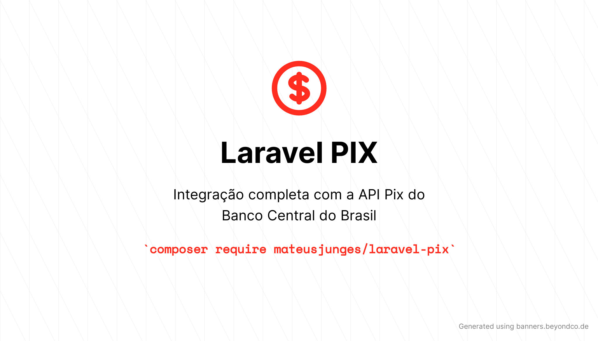

# Uma solução simples para integrar a sua aplicação Laravel com a API PIX do Banco Central do Brasil

[](https://github.com/mateusjunges/laravel-pix/actions/workflows/run-tests.yml)
[](https://styleci.io/repos/364809206)

- [Instalação](#instalao)
  - [Publicando os assets](#publicando-os-assets)
  - [Publicando o arquivo de configuração](#publicando-o-arquivo-de-configurao)
- [Endpoints](#endpoints)
- [Configurações iniciais](#configuraes-iniciais)
  - [Obtendo o token de acesso](#obtendo-o-token-de-acesso)
  - [Configurando PSPs](#configurando-psps)
- [Cob](#cob)
  - [Criando uma cobrança imediata](#criando-um-cob)
  - [Revisando uma cobrança imediata](#revisar-uma-cobrana-imediata)
  - [Consultando uma cobrança imediata](#consultando-uma-cobrana-imediata)
  - [Criar cobranças imediatas sem `transactionId`](#criando-cobranas-imediatas-sem-transactionid)
  - [Consultando lista de cobranças imediatas](#consultando-lista-de-cobranas-imediatas)
- [CobV](#cobv)
  - [Criando uma cobrança com vencimento](#criando-cobranas-com-vencimento)
  - [Revisando cobranças com vencimento](#revisando-cobranas-com-vencimento)
  - [Consultando uma cobrança com vencimento](#consultar-uma-cobrana-com-vencimento)
  - [Consultar lista de cobranças com vencimento](#consultar-lista-de-cobranas-com-vencimento)
- [LoteCobV](#lotecobv)
  - [Criando cobranças com vencimento em lote](#criando-cobrana-com-vencimento-em-lote)
  - [Revisando lotes de cobranças com vencimento](#revisar-lotes-de-cobranas-com-vencimento)
  - [Consultar lote de cobrança com vecimento](#consultar-um-lote-de-cobranas-com-vencimento)
  - [Consultar lista de lotes de cobrança com vencimento](#consultar-lista-de-cobranas-com-vencimento-em-lote)
- [Payload Location](#payload-location)
  - [Criar location do payload](#criar-location-do-payload)
  - [Consultar locations cadastradas](#consultar-locations-cadastradas)
  - [Recuperar location do payload](#recuperar-location-do-payload)
  - [Desvincular uma cobrança de um location](#desvincular-uma-cobrana-de-uma-location)
- [Pix recebidos](#pix-recebidos)
  - [Consultar um pix recebido](#consultar-pix)
  - [Consultar lista de pix recebidos](#consultar-pix-recebidos)
  - [Solicitar devolução de um pix](#solicitar-devoluo)
  - [Consultar uma devolução de pix](#consultar-devoluo)
- [Webhooks](#webhooks)
  - [Configurar o webhook pix](#configurar-o-webhook-pix)
  - [Exibir informações sobre o webhook pix](#exibir-informaes-sobre-o-webhook-pix)
  - [Cancelar o webhook pix](#cancelar-o-webhook-pix)
  - [Consutlar webhooks cadastrados](#consultar-webhooks-cadastrados)
- [Configurando endpoints](#configurando-endpoints)


Este pacote oferece integração completa com a API PIX do banco central do Brasil.

# Instalação
Você pode instalar este pacote utilizando o composer:
```bash
composer require mateusjunges/laravel-pix
```

Agora, é necessário publicar os assets utilizados e o arquivo de configuração do pacote.

## Publicando os assets

Para publicar os assets deste pacote para a pasta public do seu projeto, utilize o comando
```bash
php artisan vendor:publish --tag=laravel-pix-assets
```

## Publicando o arquivo de configuração

Para publicar o arquivo de configuração, execute o comando abaixo:

```bash
php artisan vendor:publish --tag=laravel-pix-config
```

Este comando vai copiar o arquivo `laravel-pix.php` para sua pasta config, com o seguinte conteúdo:

```php
<?php

return [

    'transaction_currency_code' => 986,

    'country_code' => 'BR',

    /*
     | O PIX precisa definir seu GUI (Global Unique Identifier) para ser utilizado.
     */
    'gui' => 'br.gov.bcb.pix',

    'country_phone_prefix' => '+55',

    /*
     * Tamanho do QR code quer será gerado pelo gerador implementado no pacote, em pixels.
     */
    'qr_code_size' => 200,

    /*
     * Você pode definir um middleware para proteger a rota disponibilizada para gerar QR codes.
     * O nome registrado para este middleware precisa ser definido aqui.
     */
    'create_qr_code_route_middleware' => '',

     /*
     * Informações do Prestador de serviço de pagamento (PSP) que você está utilizando.
     * Você pode utilizar vários psps com este pacote, bastando adicionar um novo array com configurações.
     * base_url: URL base da API do seu PSP.
     * oauth_bearer_token: Você pode definir o seu Token
     */
    'psp' => [
        'default' => [
            'base_url'             => env('LARAVEL_PIX_PSP_BASE_URL'),
            'oauth_token_url'      => env('LARAVEL_PIX_PSP_OAUTH_URL', false),
            'oauth_bearer_token'   => env('LARAVEL_PIX_OAUTH2_BEARER_TOKEN'),
            'ssl_certificate'      => env('LARAVEL_PIX_PSP_SSL_CERTIFICATE'),
            'client_secret'        => env('LARAVEL_PIX_PSP_CLIENT_SECRET'),
            'client_id'            => env('LARAVEL_PIX_PSP_CLIENT_ID'),
            'authentication_class' => \Junges\Pix\Api\Contracts\AuthenticatesPSPs::class
        ]
    ],
];
```

# Endpoints
Os endpoints disponibilizados por este pacote são os mesmos implementados pelo Banco Central, e [documentados aqui][doc_bacen].
Entretanto, o seu provedor de serviços de pagamento (PSP) pode não implementar todos eles.

A lista de endpoints completa está descrita aqui:

- Cob (Reúne endpoints destinados a lidar com gerenciamento de cobranças imediatas)
    - `PUT` `/cob/{txid}`: Cria uma cobrança imediata.
    - `PATCH` `/cob/{txid}`: Revisar uma cobrança imediata.
    - `GET` `/cob/{txid}`: Consultar uma cobrança imediata.
    - `POST` `/cob`: Cria uma cobrança imediata com id de transação definido pelo PSP.
    - `GET` `/cob`: Consultar lista de cobranças imediatas.

- CobV (Reúne endpoints destinados a lidar com gerenciamento de cobranças com vencimento.)
    - `PUT` `/cobv/{txid}`: Cria uma cobrança com vencimento.
    - `PATCH` `/cobv/{txid}`: Revisar uma cobrança com vencimento.
    - `GET` `/cobv/{txid}`: Consultar uma cobrança com vencimento.
    - `GET` `/cobv`: Consultar lista de cobranças com vencimento.

- LoteCobV (Reúne endpoints destinados a lidar com gerenciamento de cobranças com vencimento em lote.)
    - `PUT` `/lotecobv/{id}`: Criar/Alterar lote de cobranças com vencimento.
    - `PATCH` `/lotecobv/{id}`: Utilizado para revisar cobranças específicas dentro de um lote de cobranças com vencimento.
    - `GET` `/lotecobv/{id}`: Utilizado para consultar um lote específico de cobranças com vencimento.
    - `GET` `/lotecobv`: Consultar lotes de cobranças com vencimento.

- PayloadLocation (Reúne endpoints destinados a lidar com configuração e remoção de locations para uso dos payloads)
    - `POST` `/loc`: Criar location do payload.
    - `GET` `/loc`: Consultar locations cadastradas.
    - `GET` `/loc/{id}`: Recuperar location do payload.
    - `DELETE` `/loc/{id}/{txid}`: Desvincular uma cobrança de uma location.

- Pix (Reúne endpoints destinados a lidar com gerenciamento de Pix recebidos.)
    - `GET` `/pix/{e2eid}`: Consultar Pix.
    - `GET` `/pix`: Consultar pix recebidos.
    - `PUT` `/pix/{e2eid}/devolucao/{id}`: Solicitar devolucão.
    - `GET` `/pix/{e2eid}/devolucao/{id}`: Consultar devolução.

- Webhook (Reúne endpoints para gerenciamento de notificações por parte do PSP recebedor ao usuário recebedor.)
    - `PUT` `/webhook/{chave}`: Configurar o webhook pix.
    - `GET` `/webhook/{chave}`: Exibir informações acerca do webhook pix.
    - `DELETE` `/webhook/{chave}`: Cancelar o webhook pix.
    - `GET` `/webhook`: Consultar webhooks cadastrados.

# Configurações iniciais.
Para iniciar a utilização da API Pix, você precisa autenticar com o seu PSP via OAuth.
Para isso, é necessário informar o seu `client_id` e `client_secret`, disponibilizados pelo seu PSP.
Isso deve ser feito no arquivo `.env` de sua aplicação:

```text
LARAVEL_PIX_PSP_CLIENT_SECRET="seu client_secret aqui"
LARAVEL_PIX_PSP_CLIENT_ID="seu client_id aqui"
```

Vários PSP que disponibilizam a API Pix possuem uma URL para obtenção do token de acesso diferente da URL para a API. Portanto, você precisa
configurar as duas URLs no seu `.env`:

```text
LARAVEL_PIX_PSP_OAUTH_URL="url para obtenção do access token"
LARAVEL_PIX_PSP_BASE_URL="url da api pix"
```

Agora, todas as chamadas a API Pix utilizarão estas credencias, e você não precisa informar manualmente para cada requisição.
Entretando, se por algum motivo você desejar alterar estas credenciais em tempo de execução, 
é possível através dos métodos `->clientId()` e `->clientSecret()`, disponibilizados em todos os endpoints neste pacote. Um exemplo é mostrado abaixo:

```php
use Junges\Pix\Pix;

$api = Pix::api()
    ->clientId('client_id')
    ->clientSecret('client_secret');
```
Estes métodos estão disponíveis em todos os recursos da api Pix: `cob`, `cobv`, `loteCobv`, `payloadLocation`, `receivedPix` e `webhook`.

## Obtendo o token de acesso
Este pacote disponibiliza uma implementação de autenticação geral, que pode ser utilizada da seguinte forma:
```php
use Junges\Pix\Pix;

// Se você já informou o seu client_id e client_secret no .env, não é necessário informar nesta requisição.
$token = Pix::api()->getOauth2Token()->json();
```
Alguns PSPs requerem a verificação de um certificado disponibilizado no momento da criação de sua aplicação. Este certificado pode ser informado
no `.env`, ou informado na requisição através do método `certificate()`, e será carregado automaticamente na api. 

```php
use Junges\Pix\Pix;

// Se você já informou o seu client_id e client_secret no .env, não é necessário informar nesta requisição.
$token = Pix::api()->certificate('path/to/certificate')->getOauth2Token()->json();
```

Caso os endpoints do PSP utilizado necessitem da verificação deste certificado, você precisa informar 
este pacote para fazer esta verificação. Isto pode ser feito através do `AppServiceProvider` da sua aplicação, bastando adicionar esta linha ao método
`register`: 

```php
use Junges\Pix\LaravelPix;

public function register()
{
    LaravelPix::validatingSslCertificate();
}
```
Agora, todas as chamadas aos endpoints da API Pix farão a verificação com o certificado informado.

Caso a classe de autenticação disponibilizada por este pacote não funcione para obter o access token no seu PSP, 
você pode criar sua própria implementação, bastando criar uma classe e extender a class `Junges\Pix\Api\Auth`:

```php
<?php

namespace App\Pix;

use Junges\Pix\Api\Auth;

class CustomAuthentication extends Auth
{
    public function getToken(string $scopes = null)
    {
        // Metodo para retornar o token de acesso
    }
    
    public function getOauthEndpoint() : string{
        // Retorna o endpoint que deve ser utilizado para autenticação. 
        // Você precisa informar a URL completa.
    }
}
```

Agora, é necessário informar este pacote para utilizar a sua classe para obtenção do token de acesso.
Você pode fazer isso através do `AppServiceProvider` da sua aplicação:


```php
public function boot()
{
    \Junges\Pix\LaravelPix::authenticatesUsing(CustomAuthentication::class);
}
```
Agora, sua classe de autenticação com sua própria lógica será utilizada para obter o token de acesso, e o método `getOAuthToken()` retorna o
conteúdo retornado pelo método `getToken` desta classe.

> É possível configurar uma classe de autenticação para cada PSP.

## Configurando PSPs
Se você possui integrações com mais de um psp, você pode configurar os parâmetros individuais para cara um no arquivo de configurações deste pacote, 
em `config/laravel-pix.php`. 

O PSP default utilizado pelo pacote está definido na key `default`, do array de PSPs. Você pode alterar o PSP padrão através do método `useAsDefaultPsp()`,
no seu service provider:

```php
public function boot()
{
    \Junges\Pix\LaravelPix::useAsDefaultPsp('your-default-psp-here');
}
```
Para alterar o PSP em tempo de execução, você deve utilizar o método `usingPsp()`, disponível em todos os endpoints implementados neste pacote:

```php
\Junges\Pix\Pix::cob()->usingPsp('your-psp-here');
\Junges\Pix\Pix::cobv()->usingPsp('your-psp-here');
\Junges\Pix\Pix::loteCobv()->usingPsp('your-psp-here');
\Junges\Pix\Pix::payloadLocation()->usingPsp('your-psp-here');
\Junges\Pix\Pix::receivedPix()->usingPsp('your-psp-here');
\Junges\Pix\Pix::webhook()->usingPsp('your-psp-here');
```

# Cob
O Cob reúne os endpoints relacionados a criação de cobranças instantâneas.

> Consulte a documentação oficial do banco central para informações sobre o request a ser enviado para cada endpoint, 
> disponível [neste link](https://bacen.github.io/pix-api/index.html#/Cob/).

Para utilizar os endpoints do `cob`, utilize o método `cob()`, da class `Junges\Pix\Pix`:
```php
$cob = \Junges\Pix\Pix::cob();
```

## Criando um cob
Para criar uma cobrança instantânea, é necessário utilizar a api `cob`, disponibilizada pela classe `Pix`, neste pacote.

```php
use Junges\Pix\Pix;

$cob = Pix::cob()->create('transactionId', $request)->json();
```

## Revisar uma cobrança imediata
Para revisar uma cobrança imediata, deve ser utilizado o método `updateByTransactionId()`, informando o id da transação a ser atualizada e 
os dados para atualização.

```php
use Junges\Pix\Pix;

$updateCob = Pix::cob()->updateByTransactionId('transactionId', $dataToUpdate)->json();
```

## Consultando uma cobrança imediata
Para consultar uma cobrança através de um determinado id de transação, você deve utilizar o método `getByTransactionId`, informando o id 
da transação como parâmetro:

```php
use Junges\Pix\Pix;

$cob = Pix::cob()->getByTransactionId('transactionId')->json();
```
## Criando cobranças imediatas sem `transactionId`
Para criar uma cobrança imediata com `transactionId` definido pelo PSP, utilize o método `createWithoutTransactionId()`,
informando apenas os dados para criação da cobrança, sem a necessidade de passar um id de transação:

```php
use Junges\Pix\Pix;

$cob = Pix::cob()->createWithoutTransactionId($request);
```

## Consultando lista de cobranças imediatas
Para consultar a lista de cobranças imediatas com parâmetros como inicio, fim, status e outros, utilize o método `all()`, 
passando os filtros necessários. Os filtros `inicio` e `fim` são obrigatórios para toda requisição neste endpoint. Este pacote
disponibiliza uma api para aplicação de filtros na requisição, bastando instanciar uma nova classe para os filtros desejados e aplicá-los
a requisição com o método `withFilters()`:

```php
use Junges\Pix\Pix;
use Junges\Pix\Api\Filters\CobFilters;

$filters = (new CobFilters())
    ->startingAt(now()->subMonth()->toISOString())
    ->endingAt(now()->addMonth()->toISOString());

$cobs = Pix::cob()->withFilters($filters)->all()->json();
```

A lista de filtros disponíveis para o endpoint `cob` é listada aqui:

---
Filtro | Método utilizado
--- | ---
inicio | `startingAt()`
fim | `endingAt()`
cpf | `cpf()`
cnpj | `cnpj()`
cnpj | `cnpj()`
locationPresente | `withLocationPresent()` ou `withoutLocationPresent()`
status | `withStatus()`
paginacao.paginaAtual | `currentPage()`
paginacao.itensPorPagina | `itemsPerPage()`
---

# CobV
O `CobV` reúne os endpoints destinados a lidar com o gerenciamento de cobranças com vencimento.

> A documentação oficial do Banco Central do Brasil sobre os requests a serem enviados para cada endpoint pode 
> ser visualizada [aqui](https://bacen.github.io/pix-api/index.html#/CobV)

Para utilizar estes endpoints, utilize o método `cobv()`, da classe `Junges\Pix\Pix`:
```php
$cobv = \Junges\Pix\Pix::cobv();
```

## Criando cobranças com vencimento
Para criar uma cobrança com vencimento, utilize o método `createWithTransactionId`:

```php
$cobv = \Junges\Pix\Pix::cobv()->createWithTransactionId('transactionId', $request)->json();
```

## Revisando cobranças com vencimento
Para revisar e atualizar uma cobrança com vencimento, utilize o método `updateWithTransactionId`:

```php
$cobv = \Junges\Pix\Pix::cobv()->updateWithTransactionId('transactionId', $request)->json();
```

## Consultar uma cobrança com vencimento
Para consultar uma cobrança com vencimento, você pode utilizar o método `getByTransactionId`, informando o id de transação da cobrança:

```php
$cobv = \Junges\Pix\Pix::cobv()->getByTransactionId('transactionId')->json();
```

## Consultar lista de cobranças com vencimento
Para consultar a lista de cobranças imediatas com vencimento com parâmetros como inicio, fim, status e outros, utilize o método `all()`,
passando os filtros necessários. Os filtros `inicio` e `fim` são obrigatórios para todas as requisição neste endpoint. Este pacote
disponibiliza uma api para aplicação de filtros na requisição, bastando instanciar uma nova classe para os filtros desejados e aplicá-los
a requisição com o método `withFilters()`:

```php
use Junges\Pix\Pix;
use Junges\Pix\Api\Filters\CobvFilters;

$filters = (new CobvFilters())
    ->startingAt(now()->subMonth()->toISOString())
    ->endingAt(now()->addMonth()->toISOString());

$cobs = Pix::cobv()->withFilters($filters)->all()->json();
```

A lista de filtros disponíveis para o endpoint `cobv` é listada aqui:

---
Filtro | Método utilizado
--- | ---
inicio | `startingAt()`
fim | `endingAt()`
cpf | `cpf()`
cnpj | `cnpj()`
cnpj | `cnpj()`
locationPresente | `withLocationPresent()` ou `withoutLocationPresent()`
loteCobvId | `cobvBatchId()`
status | `withStatus()`
paginacao.paginaAtual | `currentPage()`
paginacao.itensPorPagina | `itemsPerPage()`
---

# LoteCobV
O `loteCobV` reúne os endpoints destinados a lidar com o gerenciamento de cobranças com vencimento em lote.

> A documentação oficial do Banco Central do Brasil a respeito dos requests que devem ser enviados em cada
> requisiçao pode se encontrada [neste link](https://bacen.github.io/pix-api/index.html#/LoteCobV);

Para utilizar estes endpointes, utilize o método `loteCobv()`, da classe `Junges\Pix\Pix`:

```php
$cobv = \Junges\Pix\Pix::loteCobv();
```

## Criando cobrança com vencimento em lote
Para criar cobranças com vencimento em lote utilize o método `createBatch()`, informando o id do lote e as cobranças que
devem ser incluídas:

```php
$batch = \Junges\Pix\Pix::loteCobv()->createBatch('batchId', $request)->json();
```
## Revisar lotes de cobranças com vencimento
Para atualizar dados de um lote de cobranças, utilize o método `updateBatch()`, informando o id do lote a ser
atualizado e os novos dados:

```php
$batch = \Junges\Pix\Pix::loteCobv()->updateBatch('batchIdToUpdate', $request)->json();
```

## Consultar um lote de cobranças com vencimento
Para consultar um lote de cobranças com vencimento, utilize o método `getByBatchId()`, informando o id do lote
que deseja consultar:

```php
$batch = \Junges\Pix\Pix::loteCobv()->getByBatchId('batchId')->json();
```

## Consultar lista de cobranças com vencimento em lote:
Para consultar a lista de cobranças com vencimento em lote com parâmetros como inicio, fim, status e outros, utilize o método `all()`,
passando os filtros necessários. Os filtros `inicio` e `fim` são obrigatórios para todas as requisição neste endpoint. Este pacote
disponibiliza uma api para aplicação de filtros na requisição, bastando instanciar uma nova classe para os filtros desejados e aplicá-los
a requisição com o método `withFilters()`:

```php
use Junges\Pix\Pix;
use Junges\Pix\Api\Filters\LoteCobvFilter;

$filters = (new LoteCobvFilter())
    ->startingAt(now()->subMonth()->toISOString())
    ->endingAt(now()->addMonth()->toISOString());

$batches = Pix::loteCobv()->withFilters($filters)->all()->json();
```

A lista de filtros disponíveis para o endpoint `loteCobv` é listada aqui:

---
Filtro | Método utilizado
--- | ---
inicio | `startingAt()`
fim | `endingAt()`
paginacao.paginaAtual | `currentPage()`
paginacao.itensPorPagina | `itemsPerPage()`
---


[doc_bacen]: https://bacen.github.io/pix-api/index.html#/


# Payload Location
O payload location reúne os endpoints destinados a lidar com a configuração e remoção dos locations utilizados nos payloads.

Para utilizar o payload location, utilize o método `payloadLocation()`, da classe `Junges\Pix\Pix`:

```php
$payloadLocation = \Junges\Pix\Pix::payloadLocation();
```

## Criar location do payload
Para criar uma location do payload, utilize o método `create`, passando a location que deseja criar:

```php
$payloadLocation = \Junges\Pix\Pix::payloadLocation()->create('payload-location')->json();
```

## Consultar locations cadastradas
Para consultar a lista de locations cadastrados, com parâmetros como inicio, fim, status e outros, utilize o método `all()`,
passando os filtros necessários. Os filtros `inicio` e `fim` são obrigatórios para todas as requisição neste endpoint. Este pacote
disponibiliza uma api para aplicação de filtros na requisição, bastando instanciar uma nova classe para os filtros desejados e aplicá-los
a requisição com o método `withFilters()`:

```php
use Junges\Pix\Pix;
use Junges\Pix\Api\Filters\PayloadLocationFilters;

$filters = (new PayloadLocationFilters())
    ->startingAt(now()->subMonth()->toISOString())
    ->endingAt(now()->addMonth()->toISOString());

$locs = Pix::payloadLocation()->withFilters($filters)->all()->json();
```

A lista de filtros disponíveis para o endpoint `payloadLocation` é listada aqui:

---
Filtro | Método utilizado
--- | ---
inicio | `startingAt()`
fim | `endingAt()`
txIdPresente | `withTransactionIdPresent()` ou `withoutTransactionIdPresent`
tipoCob | `withTypeCob()` ou `withTypeCobv()`
paginacao.paginaAtual | `currentPage()`
paginacao.itensPorPagina | `itemsPerPage()`
---

## Recuperar location do 
Para consultar a location de um payload, você deve utilizar o método `getById()`:

```php
$payloadLocation = \Junges\Pix\Pix::payloadLocation()->getById('payload-location-id')->json();
```

## Desvincular uma cobrança de uma location
Para desvincular uma cobrança de uma location, você deve utilizar o método `detachChargeFromLocation()`,
informando o id da location:

```php
$detach = \Junges\Pix\Pix::payloadLocation()->detachChargeFromLocation('payload-location-id')->json();
```

ecutado com sucesso, a entidade `loc` não apresentará mais um `transaction_id`, 
se apresentava anteriormente à chamada. Adicionalmente, a entidade `cob` ou `cobv` associada ao `txid` desvinculado também passará a não mais apresentar um location. Esta operação não altera o `status` da `cob` ou `cobv` em questão.

# Pix recebidos
Este método reúne endpoints destinados a lidar com gerenciamento de Pix recebidos.

Para utilizá-lo, utilize o método `receivedPix`, da classe `Junges\Pix\Pix`:

```php
$receivedPix = \Junges\Pix\Pix::receivedPix();
```

## Consultar pix
Você pode consultar um pix recebido através do id end to end (e2eid):

```php
$pix = \Junges\Pix\Pix::receivedPix()->getBye2eid('pix-e2eid')->json()
```

## Consultar pix recebidos 
Para consultar a lista de todos os pix recebidos, com parâmetros como inicio, fim, status e outros, utilize o método `all()`,
passando os filtros necessários. Os filtros `inicio` e `fim` são obrigatórios para todas as requisição neste endpoint. Este pacote
disponibiliza uma api para aplicação de filtros na requisição, bastando instanciar uma nova classe para os filtros desejados e aplicá-los
a requisição com o método `withFilters()`:

```php
use Junges\Pix\Pix;
use Junges\Pix\Api\Filters\ReceivedPixFilters;

$filters = (new ReceivedPixFilters())
    ->startingAt(now()->subMonth()->toISOString())
    ->endingAt(now()->addMonth()->toISOString());

$pix = Pix::receivedPix()->withFilters($filters)->all()->json();
```

A lista de filtros disponíveis para o endpoint `receivedPix` é listada aqui:

---
Filtro | Método utilizado
--- | ---
inicio | `startingAt()`
fim | `endingAt()`
txid | `transactionId()`
txIdPresente | `withTransactionIdPresent()` ou `withoutTransactionIdPresent`
devolucaoPresente | `withRefundPresent()` ou `withoutRefundPresent()`
cpf | `cpf()`
cnpj | `cnpj()`
paginacao.paginaAtual | `currentPage()`
paginacao.itensPorPagina | `itemsPerPage()`
---

## Solicitar devolução
Você pode solicitar uma devolução de um pix recebido através do método `refund`, informando o id `e2eid` do pix a ser devolvido
e um id para a devolução:

```php
$refundPix = \Junges\Pix\Pix::receivedPix()->refund('e2eid', 'refundId')->json();
```

## Consultar devolução
Você pode consultar uma devolução através do id desta devolução e do `e2eid` do pix:

```php
$refund = \Junges\Pix\Pix::receivedPix()->consultRefund('e2eid', 'refundId')->json();
```

# Webhooks
Reúne endpoints para gerenciamento de notificações por parte do PSP recebedor ao usuário recebedor.

Para gerenciar webhooks, utilize o método `webhook`, da classe `Junges\Pix\Pix`:

```php
$webhook = \Junges\Pix\Pix::webhook();
```

## Configurar o webhook pix
Este é o endpoint para configuração do serviço de notificações acerca de Pix recebidos. Somente Pix associados a um txid serão notificados.
Para configurar um webhook, você deve utilizar o método `create`, informando a chave pix e o URL para onde o webhook deve ser enviado:

```php
$webhook = \Junges\Pix\Pix::webhook()->create('pixKey', 'https://url-do-webhook.com')->json();
```

## Exibir informações sobre o webhook pix
Para consultar um webhook, utilize o método `getByPixKey`, informando a chave pix associada ao webhook:

```php
$webhook = \Junges\Pix\Pix::webhook()->getByPixKey('pixKey')->json();
```

## Cancelar o webhook pix
Para remover um webhook, utilize o método `delete`, informando a chave pix associada ao webhook:

```php
$webhook = \Junges\Pix\Pix::webhook()->delete('pixKey')->json();
```

## Consultar webhooks cadastrados
Para consultar todos os webhooks cadastrados, utilize o método `all`:

```php
$webhooks = \Junges\Pix\Pix::webhook()->all()->json();
```
Também é possível incluir alguns filtros, como inicio, fim e paginação, mas neste endpoint nenhum deles é obritagtório:

```php
use Junges\Pix\Pix;
use Junges\Pix\Api\Filters\WebhookFilters;

$filters = (new WebhookFilters())
    ->startingAt(now()->subMonth()->toISOString())
    ->endingAt(now()->addMonth()->toISOString());

$webhooks = Pix::webhook()->withFilters($filters)->all()->json();
```

A lista de filtros disponíveis para o endpoint `webhook` é listada aqui:

---
Filtro | Método utilizado
--- | ---
inicio | `startingAt()`
fim | `endingAt()`
paginacao.paginaAtual | `currentPage()`
paginacao.itensPorPagina | `itemsPerPage()`
---

# Configurando Endpoints
Para configurar endpoints específicos para cada PSP, você precisa criar um `EndpointResolver` para cada PSP que não segue a convenção do BACEN.
Para criar um endpoint Resolver, crie um classe com o nome desejado e implemente a interface `CanResolveEndpoints`, ou, simplesmente extenda a class `Endpoints`, 
disponível neste pacote. Ela fornece os endpoints necessários, e você pode copiar o array de endpoints e alterar o necessário para o seu PSP.

```php
    public array $endpoints = [
        self::OAUTH_TOKEN  => '/oauth/token',
        self::CREATE_COB   => '/cob/',
        self::GET_COB      => '/cob/',
        self::UPDATE_COB   => '/cob/',
        self::GET_ALL_COBS => '/cob/',

        self::CREATE_COBV  => '/cobv/',
        self::GET_COBV     => '/cobv/',
        self::GET_ALL_COBV => '/cobv/',

        self::CREATE_LOTE_COBV  => '/lotecobv/',
        self::UPDATE_LOTE_COBV  => '/lotecobv/',
        self::GET_LOTE_COBV     => '/lotecobv/',
        self::GET_ALL_LOTE_COBV => '/lotecobv/',

        self::CREATE_WEBHOOK => '/webhook/',
        self::GET_WEBHOOK    => '/webhook/',
        self::DELETE_WEBHOOK => '/webhook/',
        self::GET_WEBHOOKS   => '/webhooks/',

        self::RECEIVED_PIX        => '/pix/',
        self::RECEIVED_PIX_REFUND => '/devolucao/',

        self::CREATE_PAYLOAD_LOCATION     => '/loc/',
        self::GET_PAYLOAD_LOCATION        => '/loc/',
        self::DETACH_CHARGE_FROM_LOCATION => '/loc/',
        self::PAYLOAD_LOCATION_TXID       => '/loc/',
    ];
```

Após isso, registre o endpoint resolver do seu PSP na chave `resolve_endpoints_using`, do arquivo de configurações deste pacote, dentro das configurações do PSP desejado.

```php
'psp' => [
        'default' => [
            'base_url'                => env('LARAVEL_PIX_PSP_BASE_URL'),
            'oauth_token_url'         => env('LARAVEL_PIX_PSP_OAUTH_URL', false),
            'oauth_bearer_token'      => env('LARAVEL_PIX_OAUTH2_BEARER_TOKEN'),
            'ssl_certificate'         => env('LARAVEL_PIX_PSP_SSL_CERTIFICATE'),
            'client_secret'           => env('LARAVEL_PIX_PSP_CLIENT_SECRET'),
            'client_id'               => env('LARAVEL_PIX_PSP_CLIENT_ID'),
            'authentication_class'    => \Junges\Pix\Api\Contracts\AuthenticatesPSPs::class,
            'resolve_endpoints_using' => YourCustomEndpointResolver::class,
        ],
    ],
```